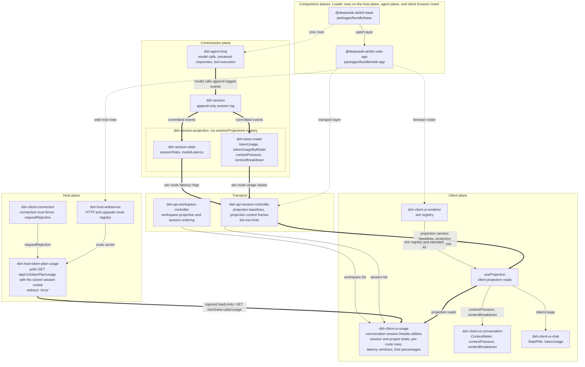

# DeepSeek Harness 架构

[English](ARCHITECTURE.md) | 中文

DeepSeek Harness 的 Loader 组合及其宿主、核心会话、传输、客户端各平面，以及从模型调用到会话标题栏用量指示器的代币用量与模型延迟路径。

```mermaid
flowchart TB
  subgraph COMP["Composition planes: Loader rows on the host plane, agent plane, and client browser roster"]
    BASE["@deepseek-ai/dsh-base<br>packages/bundle/base"]
    WEBAPP["@deepseek-ai/dsh-web-app<br>packages/bundle/web-app"]
  end

  subgraph HOSTP["Host plane"]
    WEBSERVER["dsh-host-webserver<br>HTTP and upgrade route registry"]
    FENCE["dsh-client-connection<br>connection trust fence: requestRejection"]
    TPU["dsh-host-token-plan-usage<br>polls GET /api/v1/tokenPlan/usage with the stored session cookie<br>redirect: 'error'"]
  end

  subgraph COREP["Core/session plane"]
    LOOP["dsh-agent-loop<br>model calls, streamed responses, tool execution"]
    SESSION["dsh-session<br>append-only session log"]
    subgraph PROJREG["dsh-session-projection: ctx.sessionProjections registry"]
      UNITMETER["dsh-token-meter<br>tokenUsage, tokenUsageByModel<br>contextPressure, contextBreakdown"]
      UNITSTATS["dsh-session-stats<br>sessionStats, modelLatency"]
    end
  end

  subgraph TRANSPORTP["Transport"]
    SAPI["dsh-api-session-controller<br>projection baselines, projection control frames<br>list-row hints"]
    WAPI["dsh-api-workspace-controller<br>workspace projection and session ordering"]
  end

  subgraph CLIENTP["Client plane"]
    RENDERER["dsh-client-ui-renderer<br>slot registry"]
    USEPROJ["useProjection<br>client projection reads"]
    UIMETER["dsh-client-ui-usage<br>conversation.session.header.utilities<br>session and project totals, per-route rows,<br>latency windows, limit percentages"]
    UICONV["dsh-client-ui-conversation<br>ContextMeter: contextPressure, contextBreakdown"]
    UICHAT["dsh-client-ui-chat<br>StatsPills: tokenUsage"]
  end

  BASE -->|"patch layer"| WEBAPP
  BASE -.->|"core rows"| LOOP
  WEBAPP -.->|"web host rows"| WEBSERVER
  WEBAPP -.->|"transport layer"| SAPI
  WEBAPP -.->|"browser roster"| RENDERER

  WEBSERVER -->|"route carrier"| TPU
  FENCE -->|"requestRejection"| TPU

  LOOP ==>|"model calls append logged events"| SESSION
  SESSION ==>|"committed events"| UNITMETER
  SESSION ==>|"committed events"| UNITSTATS
  UNITMETER ==>|"per-route usage values"| SAPI
  UNITSTATS ==>|"per-route latency rings"| SAPI
  SAPI ==>|"projection carriers: baselines, projection frames, list-row hints"| USEPROJ
  USEPROJ ==>|"projection reads"| UIMETER
  TPU ==>|"injected loadLimits: GET /dsh/token-plan/usage"| UIMETER

  RENDERER -->|"slot registry and standard kit"| USEPROJ
  SAPI -->|"session list"| UIMETER
  WAPI -->|"workspace list"| UIMETER
  USEPROJ -->|"contextPressure, contextBreakdown"| UICONV
  USEPROJ -->|"tokenUsage"| UICHAT
```
